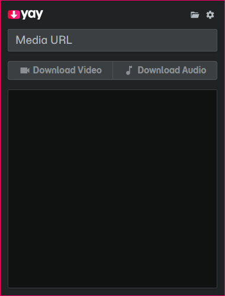
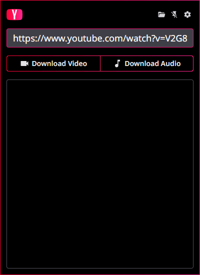
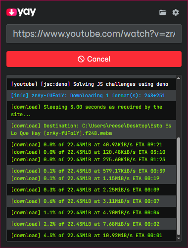
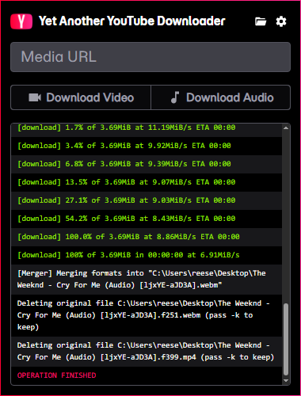

# yay

_yay_ (**Y**et **A**nother **Y**ouTube Downloader) is an [Electron](https://www.electronjs.org/)-based GUI wrapper for [yt-dlp](https://github.com/yt-dlp/yt-dlp) on Windows, running in the system tray. Despite the name, yay can download from any site supported by yt-dlp.

## Installation

yay can be installed by downloading and running the latest setup from the [releases](https://github.com/depthbomb/yay/releases/latest) page.

On first run, yay will automatically download the latest version of yt-dlp if it isn't found in your system's PATH. It will also download and use [yt-dlp's builds of FFmpeg and FFprobe](https://github.com/yt-dlp/FFmpeg-Builds).

## Screenshots

## Development

Use [Bun 1.4.1](https://bun.com/docs/installation) for dependency management and scripts, with Node.js 24 and the Rust MSVC toolchain installed. Node.js and Electron remain the JavaScript runtimes for the existing tools and application.

Run `bun install --frozen-lockfile` to install the locked dependencies. After changing dependencies with Bun, include the updated `bun.lock` with your changes.

Use `bun run test`, `bun run typecheck`, and `bun run lint` for validation. Use `bun run audit` for production vulnerabilities at any severity and high/critical vulnerabilities across all dependencies. Always use `bun run test` to invoke the existing Node.js tests.

The Vite configs for the _app_ and _renderer_ both require the _shared_ package to be built. Run `bun run build` at least once before running any other development commands.

Run the renderer in watch mode with `bun run watch` and the application in development mode with `bun run dev`.

## Distribution

The following must be installed on your system and added to the PATH:

- [Inno Setup >= 6.7](https://jrsoftware.org/isinfo.php)
- [7-Zip](https://7-zip.org)

Run `bun run package` to build the application, and `bun run create-installer` to create both the online files archive and the setup binary.

## Feature Flags

This application uses feature flags to enable or disable certain functionality at runtime. Feature flags are defined in a `features.toml` file in the app's data folder, accessible by clicking the _Open data folder_ button in application settings. The application **must be restarted** after modifying feature flags for changes to take effect.
