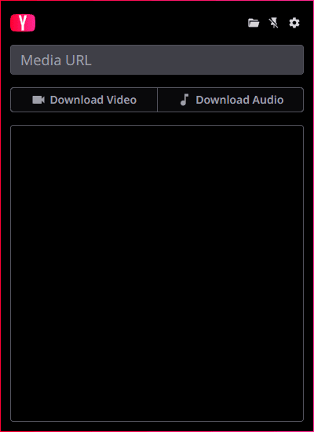

# yay

_yay_ (**Y**et **A**nother **Y**ouTube Downloader) is an [Electron](https://www.electronjs.org/)-based GUI wrapper around [yt-dlp](https://github.com/yt-dlp/yt-dlp) for Windows that runs in the system tray. Despite the name, yay can of course download from any site that yt-dlp supports.

## Installation

yay can be installed by downloading and running the latest setup in [releases](https://github.com/depthbomb/yay/releases/latest).

Upon first run, yay will automatically download the latest version of yt-dlp if it isn't found in your system's PATH. It will also download and use [yt-dlp's builds of FFmpeg and FFprobe](https://github.com/yt-dlp/FFmpeg-Builds).

## Planned features

- [ ] Allow customizing yt-dlp options when downloading
  - [x] Allow customizing output name
  - [ ] Allow supplying raw options
- [x] Improved download completion notifying
- [x] Application update checking
- [x] Improved settings UI

## Screenshots

## Development

Node.js >= 22.19.0 is required due to its automatic type stripping being the default, eliminating the need for `ts-node` to run development scripts.

The Vite configs for the _app_ and _renderer_ both require the _shared_ package to be built. Run `yarn build` at least once before any further development commands.

Run the renderer in watch mode with `yarn watch` and the application in development mode with `yarn dev`.

## Distribution

The following needs to be installed on your system and added to the PATH:

- [Inno Setup >= 6.5](https://jrsoftware.org/isinfo.php)
- [7-Zip](https://www.7-zip.org/)

Run `yarn package` to build compile the application and `yarn create-installer` to create both the online files archive and the setup binary.
