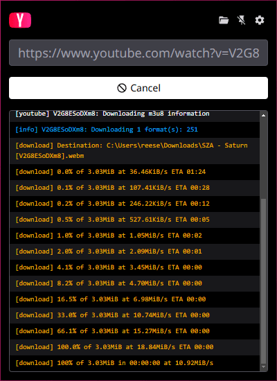

# yay

_yay_ (**Y**et **A**nother **Y**ouTube Downloader) is an [Electron](https://www.electronjs.org/)-based GUI wrapper for [yt-dlp](https://github.com/yt-dlp/yt-dlp) on Windows, running in the system tray. Despite the name, yay can download from any site supported by yt-dlp.

## Installation

yay can be installed by downloading and running the latest setup from the [releases](https://github.com/depthbomb/yay/releases/latest) page.

On first run, yay will automatically download the latest version of yt-dlp if it isn't found in your system's PATH. It will also download and use [yt-dlp's builds of FFmpeg and FFprobe](https://github.com/yt-dlp/FFmpeg-Builds).

## Screenshots

## Development

The Vite configs for the _app_ and _renderer_ both require the _shared_ package to be built. Run `yarn build` at least once before running any other development commands.

Run the renderer in watch mode with `yarn watch` and the application in development mode with `yarn dev`.

## Distribution

The following must be installed on your system and added to the PATH:

- [Inno Setup >= 6.6](https://jrsoftware.org/isinfo.php)
- [7-Zip](https://7-zip.org)

Run `yarn package` to build the application, and `yarn create-installer` to create both the online files archive and the setup binary.

## Feature Flags

This application uses feature flags to enable or disable certain functionality at runtime. Feature flags are defined in a `features.toml` file in the app's data folder, accessible by clicking the _Open data folder_ button in application settings. The application **must be restarted** after modifying feature flags for changes to take effect.

## Use of AI Tools

This project does **not** include any source code generated by artificial intelligence tools. All application logic, implementation, and architectural decisions are authored and maintained by human contributors, flaws and all.

AI tools **may** be used in a limited, non-code capacity to assist with:

- Grammar and spelling checks
- Wording improvements for documentation
- Changelog entry refinement
- README and other markdown documentation editing

No AI-generated content is used for:

- Application source code
- Build scripts or tooling
- Configuration logic

Any use of AI is strictly limited to improving clarity and readability of written documentation, and all changes are reviewed before being committed.

